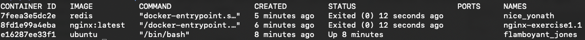

# EXERCISE 1.1: GETTING STARTED

Since we already did "Hello, World!" in the material let's do something else.

Start 3 containers from an image that does not automatically exit (such as nginx) in detached mode.

Stop two of the containers and leave one container running.

Submit the output for `docker ps -a` which shows 2 stopped containers and one running.


# Procedure
in this exercise, spin up
- ubuntu
- redis
- nginx
  
```bash
# spin up three containers
docker container run -d redis  

docker container run --name nginx-exercise1.1 \         
                          -p 8080:80 \
                          -d \
                          nginx:latest

docker container run -it -d ubuntu 


```

Then we check out their corresponding ids and stop **nginx** and **redis**

```bash
# check out their ids
docker ps -a 

CONTAINER ID   IMAGE          COMMAND                  CREATED         STATUS         PORTS                  NAMES
7feea3e5dc2e   redis          "docker-entrypoint.s…"   2 minutes ago   Up 2 minutes   6379/tcp               nice_yonath
8fd1e99a4eba   nginx:latest   "/docker-entrypoint.…"   3 minutes ago   Up 3 minutes   0.0.0.0:8080->80/tcp   nginx-exercise1.1
e16287ee33f1   ubuntu         "/bin/bash"              5 minutes ago   Up 5 minutes                          flamboyant_jones

# then we stop two of them
docker container stop 7feea3e5dc2e 8fd1e99a4eba
```

# Solution 

