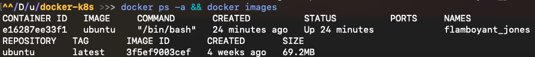

# EXERCISE1.2: CLEAN-UP
We have containers and an image that are no longer in use and are taking up space. Running `docker ps -as` and `docker images` will confirm this.

Clean the Docker daemon by removing all images and containers.

Submit the output for `docker ps -a` and `docker images`

# Solution

From exercise 1.1, i kept the ubuntu container up and running. You run the following command

```bash
# clean up unused container
docker container prune

# clean unused images 
docker image prune -a
```
The result is illustrated in the figure below




# Notes
|command|description|
|-|-|
|`docker image prune`|clean up dangling images (not tagged or used by container)|
|`docker image prune -a`|clean up unused image|
|`dockcer container prune`|clean up stopped container|