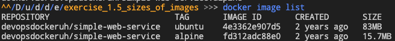
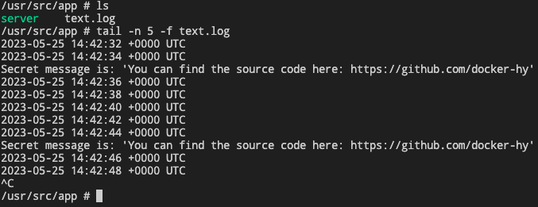

# EXERCISE 1.5: SIZES OF IMAGES

In the Exercise 1.3 we used `devopsdockeruh/simple-web-service:ubuntu`.

Here is the same application but instead of Ubuntu is using Alpine Linux: `devopsdockeruh/simple-web-service:alpine`.

Pull both images and compare the image sizes. Go inside the alpine container and make sure the secret message functionality is the same. Alpine version doesn't have bash but it has sh.

# Solution

> The course registry on dockerhub is [here](https://hub.docker.com/r/devopsdockeruh/simple-web-service/tags).

You start by pulling both images
```bash
# pulling both images
docker image pull devopsdockeruh/simple-web-service:ubuntu
docker image pull devopsdockeruh/simple-web-service:alpine

# list it out
docker image list
```
The result is 



You can see the size differences.

Then we should:
- spin up a alpine container of the web service
- get inside 
- see whether it's working or not

```bash
# spin up an alpine version of the container
docker container run \
    -it \
    -d \
    devopsdockeruh/simple-web-service:alpine

# get inside the container with the hashcode and run shell
docker container exec \
    -it \
    c0fd0e016bd2da3473ec86f412624e4256b8a7c13ef89b7e02925ce9983b578c sh

# tail the last 5 lines of the log file
tail -n 5 -f text.log
```

The output is here




# Note
Alpine and Ubuntu are both Linux distributions that are commonly used as base images for Docker containers. However, there are some differences between the two that you should be aware of.

One of the main differences is that Alpine is a much smaller distribution than Ubuntu, with a very small footprint and a minimalist design. This makes it a popular choice for containerized applications that need to be lightweight and fast. Alpine also uses the `musl` C library instead of the more common `glibc` library used by many other distributions, which can lead to some compatibility issues with certain types of software.

Ubuntu, on the other hand, is a more traditional Linux distribution with a larger feature set and a more extensive package repository. This makes it a good choice for applications that require a wider range of tools and libraries, or for applications that need to run in a more complex environment.

In general, the choice between Alpine and Ubuntu will depend on the specific needs of your application and the trade-offs you are willing to make between size, complexity, and compatibility.